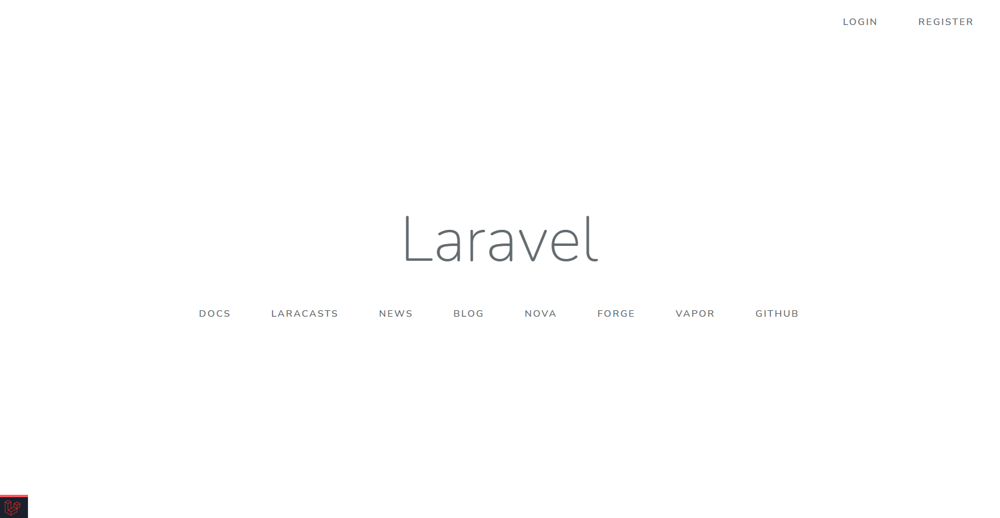
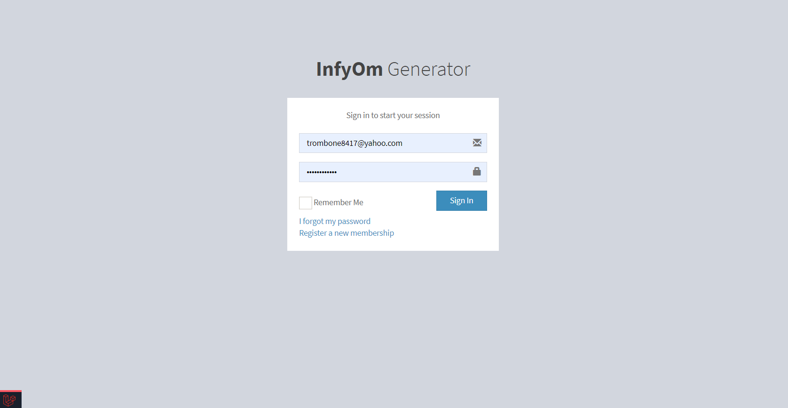
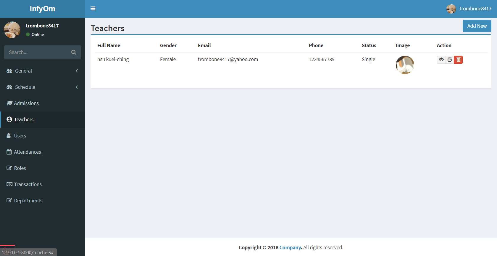
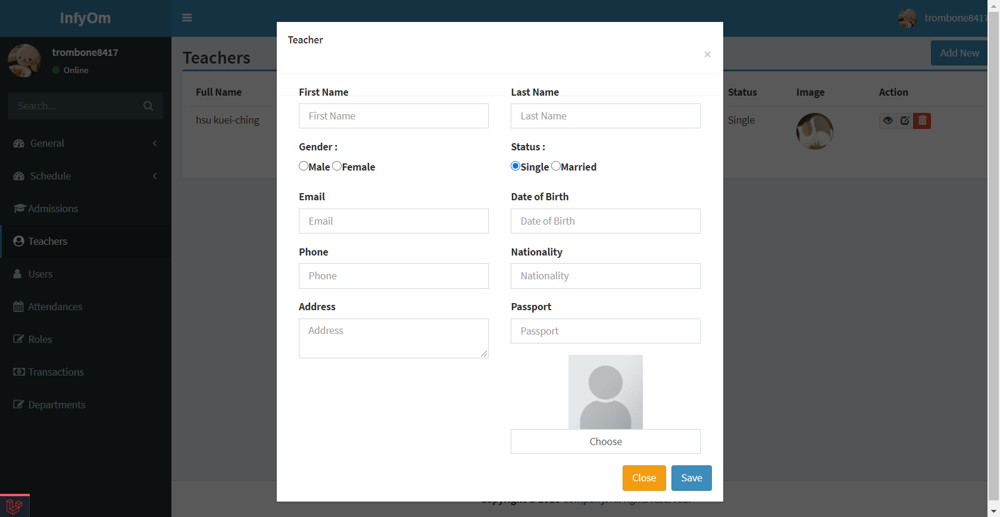
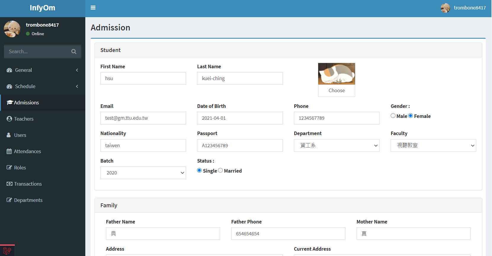

# PHP_SMS
laravel 校園資訊系統
## 簡介
本篇參考自線上教學影片(Laravel Student Information System)所練習的作品
## Migration & CRUD 指令
資料庫 migration 用法

`php artisan make:migration create_class_schedules_table --create=class_schedules`

`php artisan migrate`

自動化產生CRUD

`php artisan infyom:scaffold ClassSchedule --fromTable --tableName=class_schedules`
## 作品
##### 首頁

##### 登入

##### 教師列表

##### 教師新增

##### 學生編輯

## 資料來源
Youtube：Laravel Student Information System (Programming with Singhateh)

